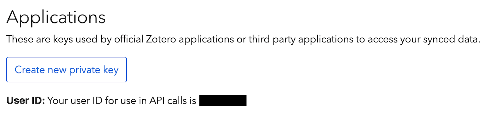

# Zotero & OpenReview

Two connectors bring your reference manager and your submissions into handoff. Both
authenticate with credentials you enter through an in-app form (never typed into the
chat, never sent to the model) — stored locally in `~/.handoff/config.json` and
overridable by environment variables.

---

## Zotero

Read your Zotero library and attach the agent's commentary back onto a paper — quoted
key passages, "relevant because X", and links to related work — so it's waiting for you
the next time you open the paper in Zotero.

> Uses the **Zotero Web API**, so your library must be **synced to zotero.org**
> (Zotero → *Settings → Sync*). The connector reads the server copy, not the local
> desktop database — anything unsynced won't be visible.

### Linking

1. Go to **<https://www.zotero.org/settings/keys>**.
2. Your **numeric user id** is shown near the top: *"Your userID for use in API calls is …"*.
3. Click **Create new private key**, tick **Allow library access** *and* **Allow write
   access** (write is required to add notes/highlights), and save. The key is shown
   **once** — copy it.
4. In handoff, run `/zotero` and paste the key + user id into the form.

The key is captured by the form and written straight to config — it never passes
through the model or the transcript.

### What you get

`/zotero-prep <paper>` runs the full flow: find the paper, read its PDF, pick the key
sentences, and **highlight them in the PDF with a comment on each explaining why it
matters** — the annotations appear right in Zotero's PDF reader. The agent also has these
tools directly:

| Tool | What it does |
|------|--------------|
| `zotero_list_papers` | List / search your library (returns each item's key). |
| `zotero_read_paper` | Read an item: existing notes/annotations + extracted PDF text. |
| `zotero_add_highlights` | **Primary.** Highlight sentences in the PDF with per-highlight comments. |
| `zotero_add_note` | Attach a standalone summary note (only if you want a written overview). |

**Highlights are the main output** — they land as real annotations on the PDF, each with
your comment, visible in Zotero's reader. For a highlight to be placed, its quote must be a
**short, contiguous, verbatim phrase** from the PDF (the connector locates it with PyMuPDF);
elided quotes with `…` can't be found. A `zotero_add_note` is optional, for a written summary.

PDF reading and highlight positioning use **PyMuPDF via [uv](https://docs.astral.sh/uv/)**
(auto-installed on first use) — no system `poppler` needed.

### Troubleshooting

| Symptom | Fix |
|---------|-----|
| "Zotero is not linked" | Run `/zotero` and enter your key + numeric user id. |
| Nothing lists / "No items" | Confirm the library is **synced to zotero.org** and the key has library access. |
| Notes fail to save | The key needs **write** access — regenerate it with write enabled. |
| Highlights all "rejected by Zotero" | Expected on some accounts — the note still carries your commentary. |
| "uv is required" when reading a PDF | Install uv: <https://docs.astral.sh/uv/>. |

---

## OpenReview

Fetch your paper submissions and their reviewer feedback — reviews, official comments,
meta-reviews, and decisions — and, on request, get help drafting point-by-point
responses grounded in your actual paper. **Read-only: handoff never posts to OpenReview.**

### Linking

1. Run `/openreview`.
2. Enter your OpenReview **email (or `~profile id`)** and **password**. They're written
   straight to config, never through the model.

### What you get

`/openreview` starts a guided flow: list your submissions, pick one, fetch its reviews,
summarize each reviewer's points, and — only if you ask — draft courteous, point-by-point
responses grounded in the paper (it reads the paper first; it won't fabricate results).
The underlying tools:

| Tool | What it does |
|------|--------------|
| `openreview_my_submissions` | List submissions where you're an author (with each forum id). |
| `openreview_reviews` | Fetch all reviews/comments/meta-review/decision for one submission. |

Uses the OpenReview **API v2** (`api2.openreview.net`).

### Troubleshooting

| Symptom | Fix |
|---------|-----|
| "login failed — check your username and password" | Verify them at <https://openreview.net>. |
| "No submissions found" | Blind or withdrawn papers may not be listed; new venues can lag. Try your `~profile id` as the username. |
| Reviews look empty | Reviews may not be released yet, or the venue uses a non-standard naming scheme. |

---

## Credentials & privacy

- Zotero and OpenReview credentials live in `~/.handoff/config.json` (plaintext, like the
  HuggingFace token) and can be set via environment variables instead — see
  [Configuration](configuration.md#environment-variables).
- Credentials are captured by the link forms and written directly to config; they are
  **never** passed as tool arguments, included in prompts, or shown in the transcript.
- Outbound traffic is limited to `api.zotero.org` and `api2.openreview.net` for these
  features. Your local library files and paper drafts stay on your machine.
