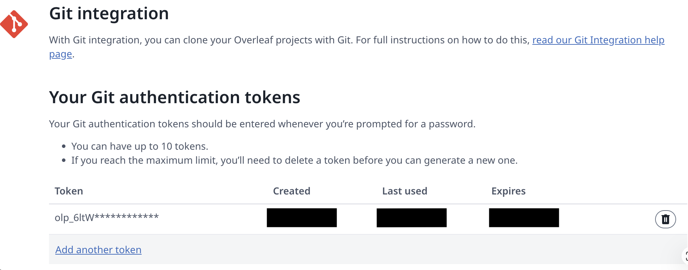

# Overleaf sync

handoff connects your research project to an existing Overleaf project and keeps the
two in sync **both ways**, so you can edit in Overleaf's web editor and in handoff
interchangeably without copy-pasting.

> Overleaf's Git integration requires a **paid Overleaf plan**. On the free tier, work
> on a local LaTeX project instead (local compile support is on the roadmap).

## Linking a project

1. Make sure you have an active project (`/project new <name>` if not).
2. In Overleaf, open the project and copy the URL from your browser — it looks like
   `https://www.overleaf.com/project/<id>`.
3. Get a **Git authentication token**: Overleaf → *Account Settings → Git Integration*.
4. In handoff, run:

   ```
   /overleaf
   ```

   Paste the project link and the token into the form. handoff clones the project into
   your active project's `paper/` directory and switches the project to Overleaf mode.

The token is handled as a sensitive credential: it's masked in the UI, stored only in
`paper/.git/config`, and redacted from any git output shown in the transcript. handoff
never prints it back.



## How sync works

Once linked, syncing is automatic and bidirectional:

- **Before each of your messages**, handoff **pulls** from Overleaf, so edits you (or a
  collaborator) made in the web editor are present before the agent touches anything.
  Local changes are committed first so the merge can't fail on unstaged work.
- **After each turn**, handoff **pushes** any changes it made to `paper/` back to
  Overleaf, and drops a short note in the transcript (`↑ synced to Overleaf: …`).

Running `/overleaf` again on a linked project shows its status and forces a sync.

You can also drive sync explicitly through the agent: ask it to *"save to Overleaf"*
(push) or *"pull the latest from Overleaf"* (sync). These map to the `overleaf_push`
and `overleaf_sync` tools.

## The single-document rule

To keep your paper compilable, handoff treats the paper as **one LaTeX document**:

- It edits the main `.tex` (the file that declares `\documentclass`, else `main.tex`)
  in place rather than scattering content across new files.
- A **write guard** blocks creating stray `.tex`/`.md` files in `paper/` and blocks
  overwriting the complete document with a fragment (which would break the PDF build).
- The **bibliography lives inside `paper/`** (`paper/refs.bib`), never in
  `literature/` — files outside `paper/` never reach Overleaf. The guard redirects a
  misplaced `.bib` back into `paper/` and reminds the model to load it with
  `\bibliography{refs}` / `\addbibresource{refs.bib}` and cite it with `\cite{...}`.

This is the single most common reason "my changes don't show up on Overleaf" — handoff
prevents it by construction.

## Troubleshooting

| Symptom | Fix |
|---------|-----|
| *"That doesn't look like an Overleaf project link"* | Copy the URL from the browser while the project is open (`overleaf.com/project/<id>`). |
| *"A Git authentication token is required"* | Generate one under Account Settings → Git Integration and paste it into the form. |
| *"The paper/ folder already has files"* | Linking needs an empty `paper/`. Move existing files out, or start a fresh project. |
| Push rejected / *"someone edited it on the web"* | A collaborator pushed first. Ask handoff to *pull the latest from Overleaf*, then retry. handoff's auto-pull usually handles this for you. |
| *"Overleaf is ahead and couldn't auto-merge"* | There's a real conflict. Open the project in Overleaf, resolve it there, then continue in handoff. |
| `git is not installed` | Install git — handoff uses it under the hood for the Overleaf bridge. |

## What syncs and what doesn't

Only `paper/` is an Overleaf clone. Everything else in the project
(`literature/`, `experiments/`, `runs/`, `results/`) is private and never uploaded.
That separation is intentional: your drafts go to Overleaf, your data and code stay on
your machine.
